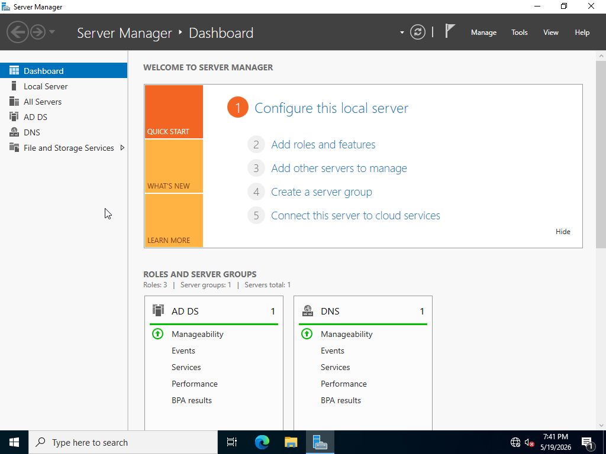
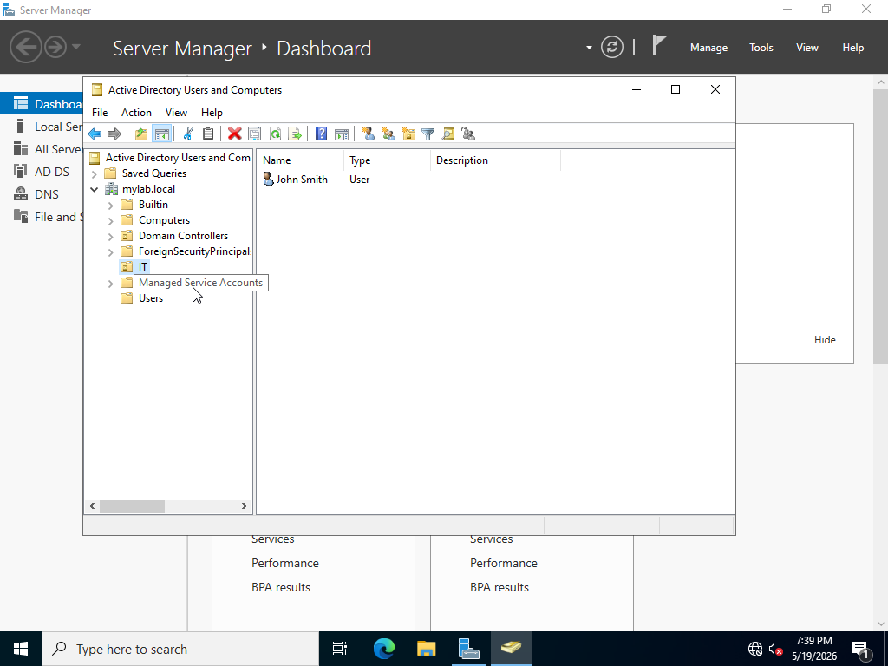
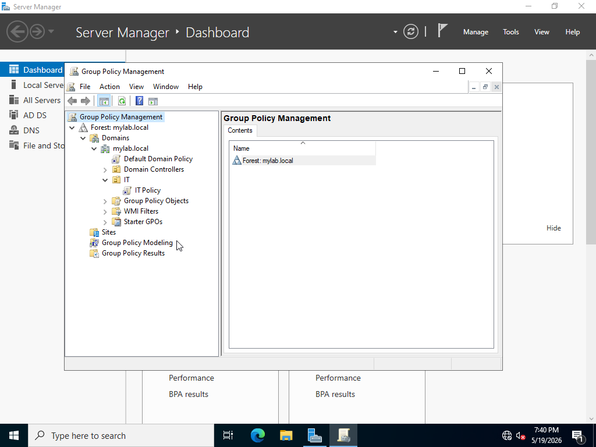

# Active-Directory-Home-Lab 

## Overview
Built a virtualized Active Directory environment using Windows Server 2022 and Oracle VirtualBox to simulate a real enterprise IT infrastructure.

## Tools Used
- Windows Server 2022
- Oracle VirtualBox
- Active Directory Domain Services (AD DS)
- Group Policy Management Console (GPMC)

## What I Built
- Deployed Windows Server 2022 in a virtualized environment
- Installed and configured Active Directory Domain Services (AD DS)
- Promoted server to a Domain Controller and created a new domain forest (mylab.local)
- Created and managed user accounts in Active Directory Users and Computers (ADUC)
- Created Organizational Units (OUs) to organize users by department
- Created and linked Group Policy Objects (GPOs) to push security settings to users

### Server Manager Dashboard

### Active Directory Users and Computers

### Group Policy Management

